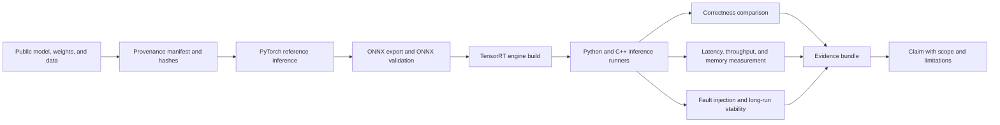

# Architecture and evidence chain

## Status

This document defines the intended system and the evidence required to support
future claims. It does **not** report a validated GPU, CUDA, or TensorRT result.
CPU-only continuous integration checks repository structure and deterministic
host-side logic; GPU evidence must come from a separately recorded compatible
NVIDIA environment.

## Objective

The lab should answer one narrow question:

> Can a public autonomous-driving perception model be converted, executed, and
> diagnosed on the NVIDIA inference stack with reproducible evidence for
> correctness, latency, memory use, and stability?

The repository is an engineering reliability lab, not a leaderboard. A faster
number is useful only when the model, inputs, precision, timing boundary, and
environment are held accountable.

## System boundary



The model and data inputs must be public and redistributable for the intended
use. The lab must never depend on employer code, customer data, private logs,
internal checkpoints, or credentials. See
[Public repository boundary](public-repository-boundary.md).

## Architectural layers

| Layer | Responsibility | Required evidence |
| --- | --- | --- |
| Provenance | Pin model, checkpoint, data subset, license, and checksums | Source URLs, revision identifiers, license references, SHA-256 hashes |
| Environment | Make the execution context explicit | Git commit, OS, CPU/GPU, driver, CUDA, TensorRT, Python/compiler versions, power/clock policy where relevant |
| Reference | Produce deterministic framework outputs | Exact command, seed, input tensor hash, reference output or metric |
| Conversion | Export ONNX and build a TensorRT engine | Export/build commands, logs, opset, optimization profiles, engine metadata |
| Execution | Run equivalent Python and C++ paths | Input/output schema, buffer lifecycle, stream/context ownership, exit status |
| Validation | Compare accuracy and numerical behavior | Dataset/subset, metric definition, tolerances chosen before the run, raw comparison artifact |
| Measurement | Separate GPU work from end-to-end work | Warm-up and sample counts, synchronization policy, raw samples, percentile summary, profiler trace |
| Reliability | Reproduce and fix defined failures | Minimal reproducer, hypothesis log, root cause evidence, fix, regression test |
| Publication | State only what the evidence supports | Report, limitations, artifact checksums, redaction and license review |

## Evidence bundle contract

Every publishable experiment should produce one immutable **local** run
directory. The implementation may evolve, but the logical contract is:

```text
results/<run-id>/
  manifest.json             # schema version, run ID, time, git commit
  environment.json          # software and hardware inventory
  assets.json               # public sources, revisions, licenses, hashes
  experiment.json           # inputs, profiles, precision, seed, run policy
  commands.txt              # exact commands in execution order
  logs/                     # unedited command output
  raw/                      # per-sample timings and comparison data
  summaries/                # derived percentiles and accuracy metrics
  profiles/                 # profiler exports, when collected
  checksums.sha256           # integrity of the evidence bundle
  report.md                 # claims, scope, limitations, artifact links
```

This bundle is not a Git commit contract. Raw engines, ONNX files, datasets,
Nsight captures, and other large generated artifacts remain untracked. Commit
only reviewed small manifests, derived summaries, templates, and reports that
pass the public-boundary review. Generated engines are environment-specific;
their build inputs, command, TensorRT version, public device description, and
checksum must still be recorded locally. Raw evidence is preserved locally or
in an approved artifact store, and every published summary must be regenerable
from it.

## Claim-to-evidence matrix

| Proposed claim | Minimum supporting evidence | Invalid shortcut |
| --- | --- | --- |
| "Outputs agree" | Same public inputs; explicit preprocessing; element/metric comparison; predeclared tolerance | Comparing only one visually convenient image |
| "FP16 preserves task quality" | Fixed public evaluation subset; framework and TensorRT task metrics; tolerance and confidence limits | Looking only at engine build success |
| "Latency is lower" | Same model/input/device policy; warm-up; raw samples; p50/p95/p99; timing boundaries and synchronization | One average or wall clock around asynchronous enqueue |
| "Throughput is higher" | Batch/concurrency/stream policy; elapsed interval; completed sample count; latency trade-off | Reporting TensorRT tool output without matching application settings |
| "Memory use is bounded" | Measurement source; peak and steady-state values; allocation phase; repeated-run evidence | A single process snapshot |
| "The fix is stable" | Minimal failure reproduction before fix; long-run test after fix; leak/error checks; regression test | "It ran once" |
| "Root cause is X" | Controlled experiment that isolates X and rules out viable alternatives | A plausible hypothesis without falsification |

## Evidence maturity levels

Use these labels in issues and reports so planned work cannot be mistaken for a
verified result.

| Level | Meaning | Allowed wording |
| --- | --- | --- |
| E0 — specified | Protocol, schema, or code exists; it has not passed the relevant run | "Designed", "implemented", "not yet executed on GPU" |
| E1 — CPU verified | CPU CI/unit tests pass; no CUDA/TensorRT conclusion follows | "CPU checks pass" |
| E2 — GPU smoke-tested | One pinned GPU environment completes the minimal path | "Runs in environment X"; no performance or generality claim |
| E3 — measured | Repeated experiment satisfies the protocol and preserves raw evidence | Scoped numerical claims for the recorded environment |
| E4 — reproduced | An independent clean run or second environment reproduces the result | Reproducible within the stated compatibility envelope |

Every report must name its level. Absence of a label means E0.

## Reliability invariants

1. Reference and TensorRT paths consume the same serialized input tensors when
   numerical equivalence is evaluated.
2. Preprocessing and postprocessing are measured separately from inference and
   are also included in a clearly labeled end-to-end measurement.
3. CUDA work is asynchronous unless proven otherwise. GPU segments use CUDA
   events; end-to-end host timing has an explicit completion boundary.
4. Warm-up iterations are excluded and reported. Individual measurement
   samples are retained; averages alone are insufficient.
5. Precision, dynamic-shape profile, batch, concurrency, and stream count are
   part of the experiment identity.
6. One execution context is not silently shared across concurrent inferences.
   Resource ownership is explicit in the C++ runner.
7. A failure fix includes a regression test or a documented reason why an
   automated test is not feasible.
8. CPU CI is never described as GPU, CUDA, TensorRT, accuracy, or performance
   validation.

## Verification surfaces

### CPU CI

CPU CI is expected to validate:

- deterministic manifest/config parsing and metrics utilities through Python
  `unittest`;
- a CMake configuration with CUDA explicitly disabled;
- compilation and CTest for host-only C++ components.

### GPU experiment host

A compatible NVIDIA host is required to validate:

- CUDA and TensorRT discovery;
- engine build and inference;
- framework/ONNX/TensorRT numerical comparison;
- GPU timing, memory, profiling, and long-run stability.

Those checks are intentionally not implied by the public CPU workflow.

## Decision record for a completed experiment

Before promoting a result to E3, the report owner answers:

1. What exact claim is being made, and what is explicitly out of scope?
2. Can another person identify and obtain every public input?
3. Can every summary number be regenerated from stored raw evidence?
4. Was the threshold chosen before looking at the result?
5. What is the weakest piece of evidence?
6. What observation would falsify the conclusion?
7. Has the public-release boundary been reviewed?

If any answer is missing, retain the lower evidence level.
