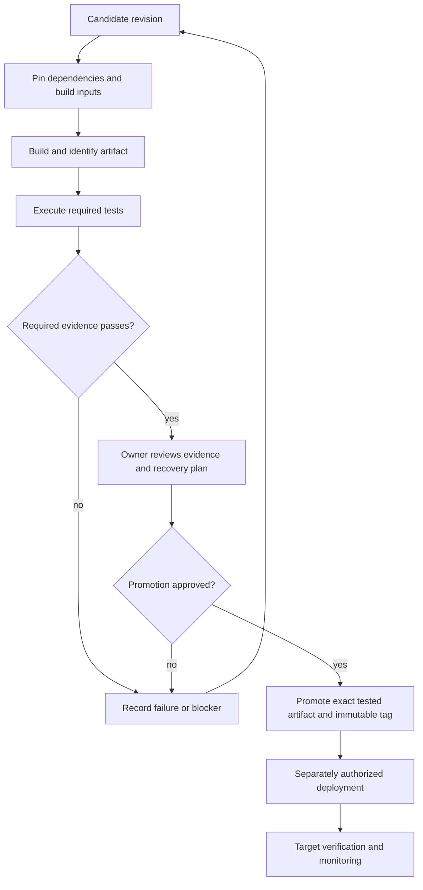

# Release evidence flow

Generic process draft; each adopting project defines its own target gates.

Changed source, dependencies, configuration, or artifacts require impact
review and appropriate revalidation before promotion.
